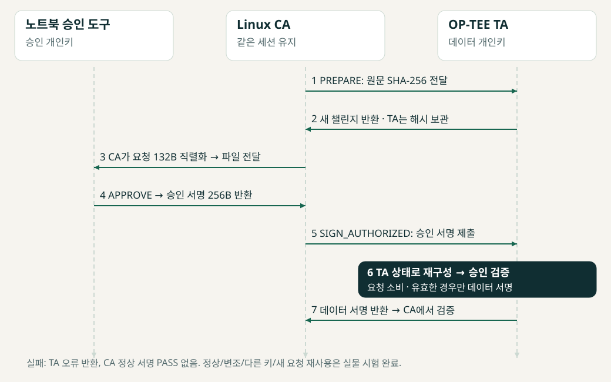
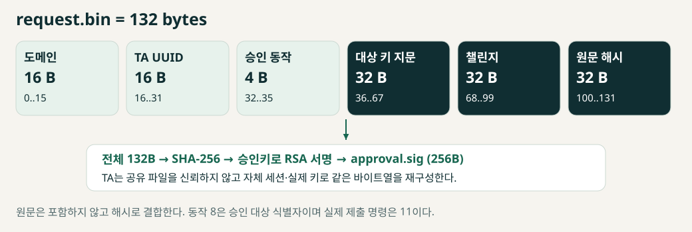
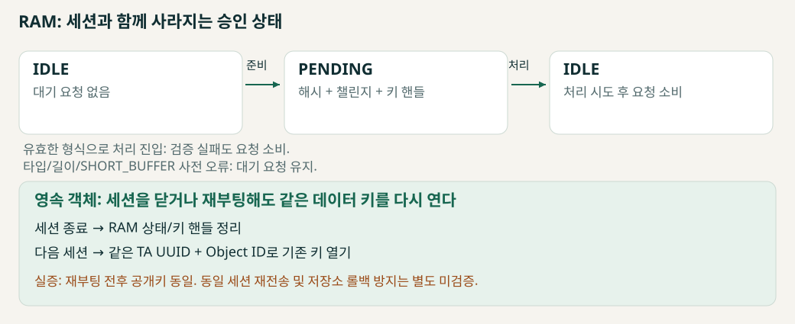

# 구조도와 설계 설명

2026-10-03. 웹과 PDF는 scripts/architecture.py의 동일한 도식 정의를 사용한다. 도식은 구현 설명이며 모든 경로의 시험 완료를 의미하지 않는다.

## 전체 시스템과 신뢰 경계

CA → libteec → Linux TEE 드라이버 → OP-TEE OS/TA의 호출 경로다. 노트북 승인 개인키는 노트북에, 데이터 개인키는 TA가 관리하는 객체에 있다. tee-supplicant는 REE 저장소 I/O 지원이며 승인 정책의 판단 주체가 아니다.

## 승인과 데이터 서명 순서

CA가 챌린지를 받은 뒤 요청을 직렬화한다. TA는 해시·챌린지·실제 키 핸들을 세션에 유지하고, 노트북 승인 후 같은 세션에서 요청을 재구성해 검증한다. 노트북 승인 서명과 TA 데이터 서명은 키와 대상이 다르다.

## 132바이트 요청 계약

도메인·TA UUID·동작·키 지문·챌린지·메시지 해시 전체를 승인한다. 원문은 요청에 직접 포함하지 않는다. 승인 대상 동작 8과 실제 제출 명령 11을 구분한다.

## 세션 상태와 영속 키

RAM 승인 상태와 영속 키를 구분한다. 형식 검사 이후 실제 처리 시도는 실패하더라도 요청을 소비한다. 사전 파라미터 오류는 요청을 유지한다. 세션 종료는 영속 키 삭제가 아니다.

## 구현과 실증의 구분

정상 승인, 서명 변조, 다른 승인키, 새 요청에 과거 승인 재사용 거부 및 재부팅 공개키 동일성은 실물 확인했다. 같은 세션 재전송·직접 우회 명령·파라미터 재시도와 롤백 방지는 미검증이다. [시험 결과](../evidence/p0-20261002T115454Z/report.md).
