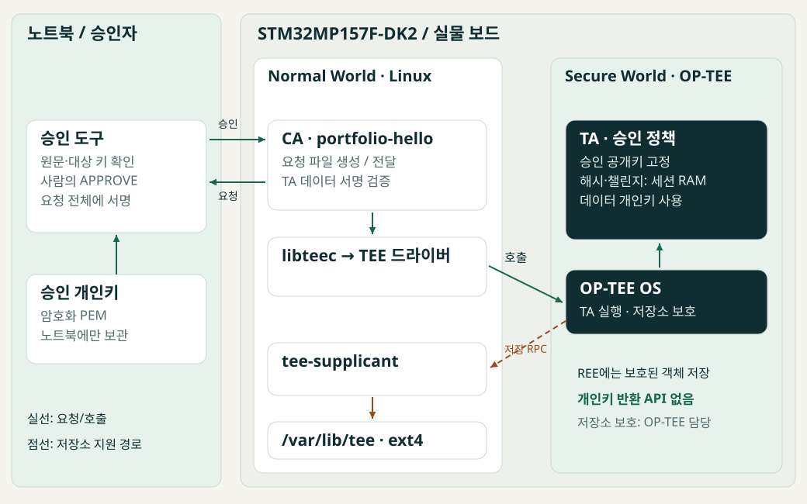

# OP-TEE 외부 승인 기반 서명 서비스 — 실증 사례

현재 결과: **PASS 21 / FAIL 0 / 미실행 0**. [전체 결과와 로그](../evidence/p0-20261002T115454Z/report.md), [발표 페이지](../index.html).

## 해결하려는 문제

개인키를 반환하지 않는 것만으로는 무단 서명을 막을 수 없다. STM32MP157F-DK2에서 TA가 외부 승인 서명을 직접 검증하고 세션에 묶인 요청만 처리하도록 구현했다.

## 구조를 먼저 보기

[구조도 4종과 해설](architecture.md): 전체 시스템 → 승인 시퀀스 → 요청 계약 → 세션/키 수명.

## 구현 범위

- CA/TA 명령 계약과 세션 카운터, ECHO, 스트리밍 SHA-256.
- TA의 RSA 데이터 서명 키 생성과 영속 객체 저장.
- 노트북 승인 도구와 132바이트 요청 직렬화, 챌린지/대상 키/메시지 해시 결합.
- TA 승인 검증·요청 소비, CA 데이터 서명 검증, Yocto 레시피로 CA/TA 패키징.

OP-TEE 저장소/암호 API, OpenSSL, ST BSP는 기반 기술로 사용했다. 이번 실증에서는 기존 패키지를 시험했고 새 빌드나 이미지 재기록은 하지 않았다.

## 정상과 거부를 함께 확인

노트북의 승인 개인키와 TA의 데이터 서명키는 역할이 다르다. CA가 요청을 전달하고 TA가 자체 세션 정보로 재구성하여 승인 서명을 검증한다. 결과표의 PASS는 각 시험의 기대 조건을 확인했다는 뜻이며, 승인 실패 시험에서는 TA 거부가 PASS다. 미실행 항목을 성공으로 간주하지 않는다.

## 재현 및 한계

[시험 절차 기록](test-procedure.md)의 명령을 기준으로 진행했다. 실행 버전·파일 해시·실제 출력은 결과 보고서에 있다. 이번 범위는 세션 상태의 모든 오류 조건, 보안 부팅, 저장소 롤백 방지를 입증하지 않는다.

발표 시 문제 → 두 키와 신뢰 경계 → 정상 승인 → 변조/재사용 거부 → 키 유지 → 미검증 범위 순서로 설명한다. 보드 사진과 실제 UART/데스크톱 캡처는 별도 수집해야 하며 현재 페이지는 실제 SSH 로그를 시각화한다.

## 공개 저장소 범위

이 저장소는 공개용 실증 자료다. CA/TA 구현 소스와 Yocto 개발 이력은 별도 비공개 저장소에서 관리하며 여기에는 포함하지 않는다. 이 전시 저장소를 clone하는 것만으로 Yocto 빌드 환경이 구성되지는 않는다.
